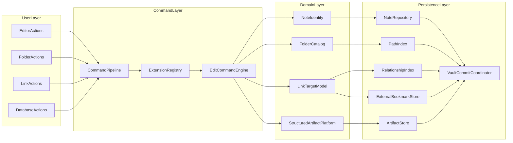

# Links, Folders, Tables, and Database Infrastructure Analysis

> **Superseded (Apr 2026):** This analysis informed the implementation of nested folders ([ADR 0003](../adr/0003-folders-paths-and-manifest-v2.md)), vault-level databases ([ADR 0004](../adr/0004-vault-level-databases-and-planning.md)), and external bookmark handling. The features described are now shipped. Retained for historical context.

## Scope and assumptions

- This analysis is aligned to current repository constraints and architecture, with two explicit product directions:
  - external file/folder links are supported through secure bookmark access,
  - long-term direction includes first-class Notion-like database capabilities.
- This document does not change current guarantees in `Constraints.md`; it defines how to extend the system without breaking local-first reliability.

## Current baseline strengths

1. **Identity-based internal links**
   - Existing note links are stable because link metadata targets `noteID` rather than path strings.
   - Rename resilience is already strong via manifest-backed resolution.

2. **Commit-oriented persistence**
   - Vault commit participants provide a clean seam for coordinated writes across note metadata and indexes.

3. **Artifact groundwork for structured data**
   - Table artifacts under `_aux/{noteID}/` establish a practical pattern for heavy data that should not bloat note sidecars.

4. **Core command/integrity model**
   - `EditCommandEngine` and normalization/integrity checks are a strong foundation for deterministic extension.

## 1) LinkTarget model and relationship invariants

### Proposed typed target model

Introduce a unified target enum used by link creation, resolution, indexing, and conflict handling:

- `note(noteID)`
- `folder(folderID)`
- `externalFile(bookmarkID)`
- `externalFolder(bookmarkID)`
- `artifact(noteID, artifactID, kind)`

### Why this model

- Preserves current resilience of note links by keeping `noteID` canonical.
- Adds first-class folder and external targets without overloading note-link semantics.
- Creates one extensible graph model for future plugin/query features.

### Invariants (must always hold)

1. **Canonical identity**
   - `noteID` is canonical for notes; path/title are derived addressing attributes.
   - `folderID` is canonical for folder nodes.
2. **Reference correctness**
   - Every link target must resolve to exactly one canonical entity or explicit broken state.
3. **Address drift tolerance**
   - Rename/move updates only addressing layers, not identity.
4. **Type safety**
   - Link target types are explicit; no runtime string guessing from plain text.
5. **Recoverable failures**
   - Unresolvable targets are represented explicitly and repairable via UX, never silently dropped.

## 2) FolderCatalog and PathIndex design

### New storage/index components

1. **FolderCatalog**
   - Stores folder nodes (`folderID`, `parentFolderID`, `name`, timestamps).
2. **PathIndex**
   - Maintains canonical path mapping:
     - `noteID -> canonicalRelativePath`,
     - `canonicalRelativePath -> noteID`,
     - optional alias paths for migration/rename continuity.

### Manifest evolution approach

- Keep current manifest compatibility while introducing versioned path-aware schema.
- Add path metadata incrementally instead of replacing existing note identity records.
- Preserve read support for flat vaults throughout migration.

### Migration strategy from flat assumptions

**Phase M1: Compatibility read**
- If no folder/path metadata exists, derive root-folder defaults.

**Phase M2: Write-forward**
- New writes emit folder/path-aware index records while still supporting old records.

**Phase M3: Reconcile and harden**
- Startup reconciliation validates path uniqueness and folder parent integrity.
- Alias entries preserve references during rename/move rollout.

### Folder invariants

- Folder parent graph is acyclic.
- A note has one canonical folder placement.
- Canonical path uniqueness is strict within a vault.
- Folder delete behavior must be explicit (`block`, `rehome`, or `cascade` policy by product decision).

## 3) External bookmark lifecycle and UX contract

### Bookmark lifecycle state machine

`created -> valid -> stale -> denied/missing -> repaired or removed`

### Required components

1. **ExternalBookmarkStore**
   - Persists bookmark payload, target type, and health status.
2. **Bookmark validator**
   - Background/job-based validation on startup and scheduled checks.
3. **Resolver integration**
   - Link resolution returns stable status (`resolves`, `permissionDenied`, `notFound`, `stale`).

### User-facing repair flows

- If link is stale/missing:
  - show clear status badge in editor/list views,
  - offer one-click relink picker,
  - preserve original link record until user resolves/removes.
- If permission revoked:
  - request re-authorization explicitly,
  - never auto-delete target metadata.

### Security and reliability principles

- Store secure bookmarks only; never rely on plain absolute path links for managed external targets.
- Keep link actions auditable through telemetry and logs.
- Treat bookmark failures as recoverable states, not silent data mutations.

## 4) Structured tables to database platform evolution

### Current structured table position

- Tables are valid v1 structured artifacts with separate storage and note-level references.
- They are not yet a full database subsystem.

### StructuredArtifact platform progression

**Stage S1: Typed tables**
- Enforce typed columns and row validation.
- Formalize schema migration policy per artifact version.
- Add better index primitives for sort/filter.

**Stage S2: Database primitives**
- Views, filters, grouped layouts, relation columns, computed fields.
- Query planner boundaries that avoid full-memory materialization.

**Stage S3: Relational scale**
- Cross-artifact and cross-note relations.
- Incremental index maintenance and background compaction/rebuild jobs.

### Memory and performance guardrails

- Lazy page/chunk loading for rows.
- View-local materialization instead of global in-memory snapshots.
- Explicit budgets for:
  - row load batch size,
  - index memory,
  - interaction latency.
- CI benchmark suite for large vault and large-table workloads.

## 5) Command pipeline and extension contracts

### Target command flow

`UI intent -> command producers -> command interceptors -> command engine/artifact command handlers -> commit coordinator participants -> index updates -> telemetry`

### Integration requirements

1. **Single mutation ingress**
   - All folder/link/artifact/database mutations pass through one command boundary.
2. **Deterministic ordering**
   - Producer/interceptor ordering is stable and versioned.
3. **Capability-gated extensions**
   - Runtime extension behavior requires explicit declared capabilities.
4. **Version contracts**
   - Semantic compatibility policy for extension APIs and command schemas.

### Extension safety controls

- Fault isolation: extension failures should degrade gracefully, not corrupt state.
- Time/resource budgets for extension execution.
- Compatibility test harness for extension contracts.

## Architecture sketch

## Risk register (ranked)

1. **High: bookmark validity churn**
   - Risk: moved/revoked external targets create silent confusion.
   - Mitigation: explicit bookmark state machine + repair UX + validation jobs.

2. **High: folder migration regressions**
   - Risk: flat-vault assumptions break discoverability or references.
   - Mitigation: two-phase migration with alias map and startup integrity checks.

3. **High: multi-index drift**
   - Risk: path/link/artifact indexes diverge after crashes or partial writes.
   - Mitigation: participant-based commit updates + reconcile routines + fault-injection tests.

4. **Medium: database memory growth**
   - Risk: large tables/views inflate RAM and degrade responsiveness.
   - Mitigation: lazy materialization, strict budgets, benchmark gates.

5. **Medium: extension instability**
   - Risk: plugin behavior destabilizes command semantics.
   - Mitigation: capability/version contracts, deterministic ordering, fault isolation.

## Build sequence (recommended)

### Phase 1: Foundation contracts
- Add `LinkTarget` model and relationship invariants.
- Add `FolderCatalog` + `PathIndex` schemas and compatibility reads.
- Add `ExternalBookmarkStore` with state lifecycle and telemetry.

### Phase 2: Folder/link user workflows
- Folder create/move/rename UX.
- Unified link creation for note/folder/external/artifact targets.
- Commit-participant updates for all related indexes.

### Phase 3: Structured artifact hardening
- Typed table schema + migration + validation.
- Index-backed sort/filter primitives.

### Phase 4: Database feature layer
- Views, relations, computed fields, query planning boundaries.
- Feature flags until operationally stable.

### Phase 5: Extension maturity
- Fully wire extension registry into command pipeline.
- Ship capability/version contracts and compatibility test suites.

## Implementation outcome

This integration path keeps current local-first reliability intact while adding first-class support for folders, external file/folder links, and long-term database expansion. It avoids heavyweight runtime coupling by preserving identity-first semantics, commit-based consistency, and staged extensibility contracts.
