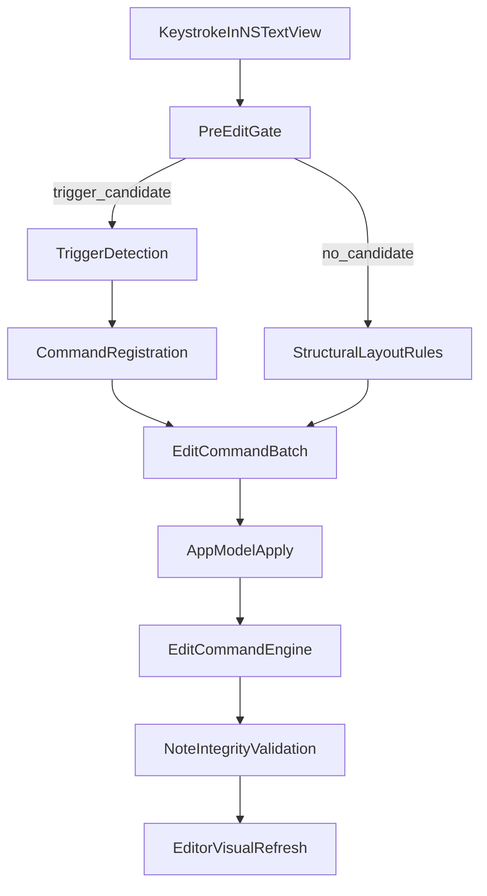

# Slash Command Framework

This document defines the long-term pattern for adding slash-driven components in Miran Notes.

## Goals

- Keep command behavior deterministic and easy to reason about.
- Make new commands additive (register + tests) instead of invasive editor rewrites.
- Preserve metadata integrity (`blocks`, `spans`, `links`) after every command batch.
- Support both slash tokens and lightweight markdown-style triggers through one framework.

## Pipeline Contract

Slash-driven transformations flow through four explicit layers:

1. Detection
2. Registration
3. Execution
4. Validation

### 1) Detection Layer

Responsibility:
- Read editor deltas and identify whether an edit is a known trigger.
- Produce a normalized invocation payload that is independent of UI widgets.

Rules:
- Trigger detection must be pure and side-effect free.
- If detection is ambiguous, return `nil` and allow normal text replacement.
- Detection is only allowed to read current document text, insertion diff, and block location.

Current trigger families:
- Slash commit (`/token` committed with space/newline).
- Markdown bullet trigger (`- ` at line start).

### 2) Registration Layer

Responsibility:
- Map invocation IDs and aliases to a command producer.
- Resolve precedence deterministically.

Required descriptor fields:
- `id`: canonical identifier (`list`, `heading1`, etc).
- `aliases`: alternate tokens (`bullet` for list).
- `commitPolicy`: accepted commit characters.
- `applicability`: optional block-type constraints.
- `produce`: pure function returning `[EditCommand]?`.

Rules:
- Registry order must be stable and explicit.
- No command may mutate editor state directly; only emit `EditCommand`s.
- Unsupported tokens return `nil` instead of partial behavior.

### 3) Execution Layer

Responsibility:
- Apply produced batches through `AppModel.apply`.
- Keep model mutation centralized in `EditCommandEngine`.

Rules:
- Handlers emit minimal, ordered command batches.
- Batches should be atomic from the user’s perspective.
- Prefer existing command primitives (`replaceText`, `changeBlockType`, `splitBlock`, `mergeWithPrevious`).

### 4) Validation Layer

Responsibility:
- Guarantee document invariants after command application.

Safety checks:
- Block partition remains sorted and contiguous over text.
- Span and link ranges remain bounded and non-overlapping with invalid regions.
- Batch size respects command pipeline contract.

Fallback:
- When detector or producer cannot confidently transform, fall back to plain text replacement path.

## Structural Rule Interactions

`DocumentLayoutController` owns Enter/Backspace structural behavior. Trigger transformations and structural rules must not conflict:

- Trigger transforms run only when exact trigger predicates pass.
- Otherwise, structural rules own the event.
- List-specific Enter behavior is defined as a structural rule, not a slash producer.

This separation keeps command registration focused on mode activation while keeping editing semantics centralized.

## Command Authoring Template

For each new command:

1. Add descriptor in registry with `id`, `aliases`, and producer.
2. Ensure producer emits only `EditCommand`s.
3. Add detector tests for positive and negative paths.
4. Add structural tests if command changes Enter/Backspace behavior.
5. Add regression tests for metadata integrity.

## Reliability Checklist (Required for PRs)

- Command has at least one positive detector test.
- Command has at least one negative detector test.
- Command behavior is deterministic for ambiguous input.
- Command batch preserves undo semantics and does not bypass `AppModel.apply`.
- No integrity regressions in note metadata tests.

## Extension Guidance

Use this same pattern for future interactive components:
- Checkboxes
- Table embeds
- Bullets and numbered lists
- Callouts and dividers

If a feature needs custom UI behavior, keep the activation in trigger/registry and route model mutations through command batches to avoid hidden side effects.
