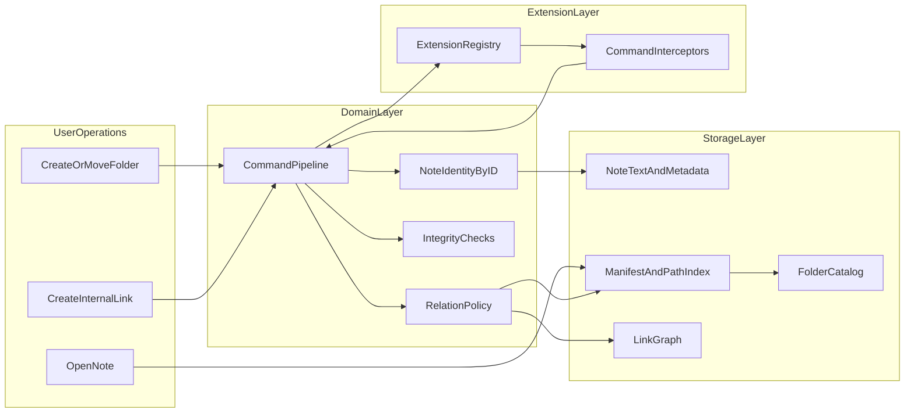

# User and Technical Architecture Priorities Brief

> **Superseded (Apr 2026):** The priorities and folder/link architecture proposed here have been implemented — folders landed via [ADR 0003](../adr/0003-folders-paths-and-manifest-v2.md), the risk register items are addressed in [Constraints.md](../../Constraints.md), and extension contracts are documented in [extension-registry-and-interceptors.md](extension-registry-and-interceptors.md). Current product direction is in the [engineering brief](../investor-and-engineering-brief.md). Retained for historical context.

## 1) Executive Perspective (User-Facing)

### Product priorities users should feel every day

1. **Fast and stable editing**
   - Typing, formatting, and navigation must feel immediate on large notes and large vaults.
   - No visible stalls during autosave, indexing, or background reconciliation.

2. **Trust and recoverability**
   - Users should never feel that edits disappeared silently.
   - When ambiguity exists (repair/conflict), the app should explain what happened and provide explicit choices.

3. **Simple mental model**
   - Notes live in local files.
   - Links behave predictably.
   - Folder operations should act like a file explorer while preserving identity and backlinks.

4. **Notion/Obsidian-like feel without heavyweight runtime**
   - Rich structure and smooth navigation should come from a disciplined command/persistence pipeline, not always-on high-memory in-memory models.
   - UI can feel modern and fluid while storage remains local-first and transparent.

5. **Future-safe behavior**
   - Features should evolve without breaking user data or changing core interaction patterns unexpectedly.

### UX priorities ordered by impact

1. **Navigation and workspace clarity**
   - Folders, recent notes, and backlinks should be easy to understand and trust.
2. **Linking ergonomics**
   - Creating note links and folder-driven links should be intuitive and resilient to rename/move operations.
3. **Conflict and repair clarity**
   - Better language in alerts and banners: what changed, what is safe, what action is recommended.
4. **Predictable undo**
   - Undo behavior should remain consistent with documented stack reset cases.
5. **Progressive power**
   - Advanced workflows (slash commands, plugins, metadata views) should not burden basic note-taking.

## 2) Technical Architecture Perspective

### Current strengths

- **Local-first and clear boundaries**
  - `MiranNotesCore` concentrates domain logic (`EditCommandEngine`, normalization, integrity checks).
  - `MiranNotesApp` owns UI/application orchestration and repository integration.
- **Command-based mutation path**
  - Edits flow through `EditCommandEngine`, making behavior testable and deterministic.
- **Repair and conflict awareness**
  - Structural repair and external conflict handling already exist and are surfaced to users.
- **Persistence hardening progress**
  - Atomic write discipline and multi-file commit orchestration (`VaultCommit`) reduce consistency risk.
- **Identity-first links**
  - Note links target stable `noteID` values, reducing fragility during note rename.

### Current fragility points

- **Flat vault assumptions**
  - Discovery and manifest reconciliation currently assume root-level note files.
- **Folders are not first-class**
  - No canonical folder model, path index, or folder move/rename invariants.
- **Extension plumbing is partial**
  - Extension registry exists but runtime integration remains limited.
- **Semantic ambiguity is unavoidable**
  - Repairs can preserve structure but cannot always recover original user intent.
- **Undo memory and stack semantics**
  - Snapshot undo remains robust but needs explicit policy and user-facing clarity for pruning/invalidations.

### Clarity of module boundaries

- **Good boundary:** command semantics and integrity in core.
- **Needs refinement:** repository currently blends storage orchestration, manifest updates, and relationship maintenance.
- **Needs explicit contract:** extension capabilities and plugin hooks should move from scaffold to stable interfaces with versioned expectations.

## 3) Folder + Link Architecture Proposal (Concrete)

### Core principle

- **Canonical identity remains `noteID`.**
- **Folder/path is an addressing and organization layer, not identity.**

This keeps links robust through move/rename operations while enabling folder-based workflows.

### Proposed model additions

1. **FolderCatalog**
   - New persisted catalog in `.miran/` describing folder nodes and parent relationships.
   - Canonical folder identity (`folderID`) with path derived from parent chain.

2. **Manifest path index**
   - Extend manifest entries to include `folderID` and computed `relativePath`.
   - Keep `noteID` as primary key; maintain path aliases for migration/redirect support.

3. **Relation types**
   - `noteToNote`: existing link graph semantics by `noteID`.
   - `folderToNote`: explicit relation entry (`folderID -> noteID`) for pinned/default/curated relationships.
   - Optional `folderToFolder` later (deferred unless product need emerges).

4. **Resolver behavior**
   - Resolver supports:
     - `noteID -> current relativePath`
     - `relativePath -> noteID`
     - alias path -> canonical note

### Metadata automation lifecycle

- On create/move/rename/link actions:
  1. Validate command and target existence.
  2. Update canonical note metadata if needed.
  3. Update manifest path index and folder catalog in same logical commit.
  4. Update link graph/relation index.
  5. Emit telemetry and integrity checks.

- Invariants:
  - `noteID` uniqueness is absolute.
  - A note has exactly one canonical folder membership.
  - `relativePath` uniqueness is enforced per vault.
  - Folder and link indices must be reconstructable from persisted state.

### User contract that stays stable

- Users can rename/move notes and folders without breaking internal links.
- Backlinks and references remain accurate after structural organization changes.
- Any ambiguous case is surfaced; no silent semantic reinterpretation.

## 4) Risk Register and Hardening Plan

| Severity | Risk | Trigger | User Impact | Technical Impact | Mitigation | Validation |
|---|---|---|---|---|---|---|
| High | Cross-file consistency window | Crash between file/index writes | Missing or stale links/folder placement | Divergent txt/meta/index state | Keep `VaultCommit` participant pipeline; add recovery scan at startup | Crash-simulation tests; startup reconciliation telemetry |
| High | Folder migration breakage | Introduce nested paths without compatibility | Notes disappear or links appear broken | Manifest/path mismatch | Two-phase migration with alias map and rollback | Migration fixture tests on mixed old/new vaults |
| High | External edit TOCTOU | File changes during autosave/reconcile | Confusing conflict prompts | Stale decisioning | Keep revision tokens and dirty-state checks; improve conflict context copy | External-edit race tests with repeated events |
| Medium | Plugin contract drift | Ad-hoc extension points | Unstable behavior across versions | Coupled internals and regressions | Versioned extension capabilities; compatibility matrix | Contract tests per capability level |
| Medium | Undo policy surprise | Aggressive pruning without visibility | Unexpected undo loss | Hard-to-debug state transitions | Bounded policy + optional subtle UX signal when pruned | Long-session memory and undo-behavior tests |
| Low | Index growth overhead | Large vault, many relations | Slight delay in navigation/search | Increased rebuild cost | Incremental index updates + background full rebuild trigger | Benchmarks on large synthetic vaults |

## 5) Flexibility and Plugin-Readiness Roadmap

### Phase 1: Stabilize core contracts

- Finalize command pipeline contracts (`produce -> intercept -> apply -> persist -> index`).
- Define extension capability levels and minimum compatibility guarantees.
- Keep built-ins as default providers to avoid runtime complexity spikes.

### Phase 2: Folder and relation infrastructure

- Add `FolderCatalog` and manifest path index.
- Introduce folder-link relation index and resolver updates.
- Maintain backward compatibility with flat vaults.

### Phase 3: Runtime extension integration

- Wire extension registry into command pipeline.
- Add safe interceptor/producer execution boundaries.
- Add plugin diagnostics (latency, failures, disabled extensions).

### Phase 4: Scale and polish

- Add vault-scale performance budgets and CI benchmark checks.
- Improve user-facing messaging for repairs/conflicts/fallbacks.
- Harden migration and integrity tooling for long-lived vaults.

## 6) Near-Term Decisions (Next Milestones)

### Do now

1. **Commit to identity model**
   - Keep `noteID` canonical; path/folder are secondary address layers.
2. **Implement first-class folder schema**
   - Add folder catalog + manifest path index in a backward-compatible format.
3. **Codify relation invariants**
   - Define and test note↔note and folder→note invariants.
4. **Improve conflict and repair copy**
   - Provide clearer user guidance in alerts/notices with recommended safe action.
5. **Harden extension contracts**
   - Publish versioned extension capability policy and contract tests.

### Defer now (intentionally)

- Full real-time collaborative editing architecture.
- Overly dynamic runtime plugin loading before contract maturity.
- Deep visual block virtualization until folder/link model and persistence invariants are stable.

## Architecture Sketch

## Summary

Miran Notes already has strong foundations for a local-first, flexible system. The next architectural step is to make **folders and relationship indexing first-class** while preserving **identity-first links**, **clear user conflict semantics**, and **tight extension contracts**. That combination supports a polished Notion/Obsidian-like feel without drifting into heavyweight runtime complexity.
