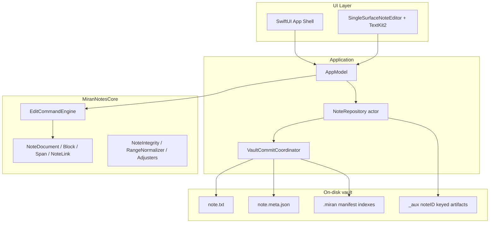

# Miran Notes — Investor & Engineering Brief

**Purpose:** This document explains what Miran Notes is, why it exists, how it works for users and under the hood, and where the product and codebase are headed. It is written for **investors** who need a clear value story and for **software engineers** who need a map of the system, honest gaps, and prioritized improvement areas.

**Scope note:** Financial projections, market sizing, and go-to-market strategy are **not** specified in the repository; those would need founder input to make an investment case complete.

---

## 1. Introduction and product overview

### What the app is

**Miran Notes** is a **local-first, macOS-native** notes application. Each note is stored as human-readable files in a **vault**: canonical body text in `note.txt`, structured metadata (blocks, inline styles, wiki links, embedded artifact references) in a sidecar `note.meta.json`, plus vault-level indexes under a `.miran/` directory (manifest, link graph, relationship index, folder catalog, path index).

**Problem it solves:** Many knowledge workers want the **feel** of modern linked notes (Notion-like slash commands, Obsidian-like `[[wiki links]]`) without surrendering data to a hosted service or running a heavy, plugin-dependent runtime. Miran targets users who value **speed, ownership of files, and predictable behavior** on a single machine—students, lawyers, researchers, and developers who treat notes as durable assets.

**Why local-first matters:** Notes remain ordinary files that can be backed up, diffed, and opened with other tools. The app adds structure and navigation on top without making the filesystem opaque.

### Why it was created

The motivation (as reflected in project constraints and architecture docs) is to **close the gap** between:

- **Heavyweight cloud editors** that own your data and require constant connectivity, and  
- **Power-user tools** that are extremely capable but can demand significant configuration or operational overhead.

Miran aims for a **disciplined editing pipeline**—commands, integrity checks, atomic persistence—so the product can feel responsive and “modern” while storage stays simple and inspectable.

**Vision (1–3 years, directional):** Strengthen **identity-first linking** and **folder/path organization** without breaking links on rename; mature **extension contracts** so features can ship without destabilizing core editing; optional **sync or multi-device** layers would sit *above* the local vault model rather than replacing it (explicitly not a current core goal). Richer structured content (e.g. tables stored as JSONL beside notes, per ADR 0002) can grow without bloating the plain-text hot path.

### High-level value proposition

| Theme | What Miran emphasizes |
|--------|------------------------|
| **Trust** | Detect ambiguity between text and metadata; surface repairs and conflicts instead of silent corruption (see Constraints). |
| **Performance posture** | Incremental editor updates, debounced indexing, bounded undo, dirty-flag index writes—designed to stay responsive on large notes and vaults. |
| **Differentiation** | Not another web app in Electron: **Swift + SwiftUI + TextKit2**, command-driven model, **UUID `noteID`** for stable links independent of filenames. |
| **Extensibility (directional)** | Open **slash command registry**; `ExtensionRegistry` protocols for producers/interceptors; sidecars and `_aux/` for heavy data without blocking typing. |

---

## 2. How the app works at the user level

### User journey and main flows

1. **Open or create a vault** — Notes appear from the vault manifest; the user picks a note to edit.  
2. **Edit in the block-aware editor** — Content is edited in a **single `NSTextView`** surface with block semantics (headings, paragraphs, lists, code, callouts, dividers). Typing flows through a **single pipeline** into `EditCommand`s and `EditCommandEngine`.  
3. **Format and structure** — Toolbar or shortcuts toggle span styles (bold, italic, code); structural edits (split/merge blocks) follow deterministic rules.  
4. **Slash commands (Notion-like discovery)** — Typing `/` at **line start** opens a **searchable menu** near the caret; built-ins include `/h1`–`/h3`, `/p`, `/code`, `/list` (alias `/bullet`), `/divider`, `/callout`. Auto-commit works when the user types `/token` + space or newline. Unknown tokens stay **plain text**; the menu can show “No commands found.”  
5. **Wiki links** — `[[Display Title]]` in the body; metadata stores ranges and `targetNoteID` for navigation and backlink-style workflows. Links resolve by **note ID**, not filename.  
6. **Persistence** — Debounced autosave writes text and metadata; vault commit runs a **two-phase** prepare/commit so partial multi-file updates are avoided.  
7. **External edits** — Filesystem watching reloads when safe; if the buffer is dirty and disk changed, the user gets an explicit **conflict** choice.  
8. **Tables (structured artifacts)** — Per ADR 0002, table data can live as **JSONL** under `_aux/{noteID}/`; the app can open a table editor sheet tied to those files (lazy load, separate undo scope for the table surface).

**Typical session:** Open a note, write with slash commands and inline formatting, insert internal links, rely on autosave, optionally open backlinks or related notes (backlink graph is cached and debounced in `AppModel`).

### Key features and examples

| Feature | Example | Comparison |
|--------|---------|------------|
| **Block model + headings** | Turn a line into H2 via `/h2` or block typing | Similar *intent* to Notion blocks; implementation is one TextKit surface, not per-block web components. |
| **Slash discovery** | `/bul` filters to list | Comparable to Notion’s slash menu; **line-start only** by design (see Constraints). |
| **Wiki links** | `[[Project plan]]` | Like Obsidian wikilinks; **targets are UUIDs in metadata**, reducing breakage on rename. |
| **Undo** | Document-level snapshots, **200 steps** cap | Simpler mental model than dual undo stacks; memory scales with note size × depth (documented trade-off). |
| **Repair / notices** | Banner after load-time normalization | Honest about ambiguity—unlike tools that silently rewrite structure. |

**Differentiation in one sentence:** Familiar *patterns* (slash, wikilinks, blocks) with an **opinionated local-first architecture**: plain text + sidecar + command engine, not a hosted document graph or an everything-is-a-plugin model.

### Screens and interactions (textual)

- **Editor:** Single scrolling surface with visual styling applied from the model (`EditorVisualStyle`)—fonts per block type, styled spans, link coloring.  
- **Caret-aware operations:** `editorCursorOffset` binds caret position so actions like link insertion land at the cursor.  
- **Banners:** Dismissible notices for structural repair, missing link metadata hints, full-buffer replace fallback, or **1 MB (UTF-16) note size cap**.  
- **Vault chrome:** Sidebar/navigation patterns depend on shipped UI; repository docs emphasize manifest-backed note list and folder/path indexes as data-layer concepts—**full nested-folder product UX may still be catching up to index capabilities** (see §4).

---

## 3. Technical architecture and design decisions

### High-level architecture

**Data flow (create/edit note):** User input → `NSTextStorage` delegate → `EditCommand` batch → `AppModel.apply` → `EditCommandEngine.apply` → updated `NoteDocument` → `EditorVisualStyle` refresh → debounced save → `NoteRepository` persists via `VaultCommitCoordinator` participants (note files + link graph + relationship index + folder catalog + path index as applicable).

**Linking:** Outgoing targets update `LinkGraph`; `RelationshipIndex` tracks richer link relationships; resolution uses manifest + `LinkResolver`. **Backlinks** use an in-memory cache refreshed on a **debounced** schedule, invalidated on save/reload.

### Key components and responsibilities

| Component | Responsibility |
|-----------|----------------|
| **MiranNotesCore** | Domain model, `EditCommand` semantics, `splitBlock` with span/link boundary constraints, integrity and normalization, `ExtensionRegistry` types. |
| **MiranNotesApp / AppModel** | Session state, undo deque + `UndoManager` integration, autosave scheduling, repair notices, conflict alerts, backlink cache, command interceptors (with UUID deregistration). |
| **SingleSurfaceNoteEditor** | TextKit2 bridge, incremental vs full-buffer updates (`TextEditDiff`), slash/menu UX, size limit gate, IME-safe behavior. |
| **SlashCommandRegistry** | Built-ins + **open** `register(_:)` for additional commands. |
| **NoteRepository** | Vault lifecycle, manifest load/rebuild, atomic writes, `NoteLoadResult` with repair warnings. |
| **VaultCommitCoordinator** | Two-phase **prepare → atomic rename** for multi-file commits. |
| **Indexes** | `LinkGraph`, `RelationshipIndex`, `FolderCatalog`, `PathIndex` — each with **`isDirty`** to skip unnecessary writes. |

### Important design decisions (and trade-offs)

1. **`noteID` as single source of truth** — `NoteDocument.id` is computed from `metadata.noteID`. Filenames are display/storage slugs (with UTF-8 slug length cap). **Trade-off:** Extra indirection vs path-as-identity; **win:** stable links across renames.  
2. **Plain text + sidecar vs rich text file** — Canonical string in `.txt`; styles/links in JSON. **Trade-off:** Must reconcile text and metadata when external tools edit `.txt` only; **win:** human-readable, diff-friendly, tool-agnostic body.  
3. **Command-only mutation** — All structural edits go through `EditCommandEngine`. **Trade-off:** Up-front rigor; **win:** testability and consistent invariants.  
4. **Snapshot undo** — Not inverse commands. **Trade-off:** Memory; **win:** correctness and simpler reasoning.  
5. **No SQLite in core path** — Files + JSON indexes. **Trade-off:** Custom consistency discipline; **win:** transparency, simple backup story.  
6. **Atomic multi-file commits** — Reduces torn state across manifest and indexes.  
7. **Semantic reconciliation policy** — When text and metadata disagree, the system **must not silently guess user intent**; user-visible repair/conflict flows are required (Constraints).  
8. **Tables in JSONL (ADR 0002)** — Heavy rows off the main editing loop; lazy load and separate table undo.  
9. **ExtensionRegistry** — Capability-tagged producers/interceptors; **runtime integration depth may still be evolving**—treat as architectural direction, not a full plugin marketplace yet.

### Extensibility and future-proofing

- **Schema versioning** in metadata and index files supports migration.  
- **`ExtensionPoints.swift`** documents roadmap placeholders (nested blocks, sync transport, richer inline) without forcing premature implementation.  
- **Slash registry** allows new commands without forking the editor.  
- **Auxiliary storage pattern** (`_aux/{noteID}/`) allows structured artifacts without merging megabytes into `note.txt`.

**Engineering expectation:** New features should state **what is stored where**, how **migration** works, and impact on **performance** and **constraints** (per internal docs).

---

## 4. Critical analysis and gaps

### Honest assessment of the current system

**Solid:**

- Clear split: **Core** (model + engine) vs **App** (UI + persistence).  
- Documented **constraints** and **ADRs** for links, auxiliary storage, slash behavior.  
- **Automated tests** (core, app, watcher races, performance baselines) and explicit **integrity** hooks.  
- **Hardening** already shipped: atomic commits, dirty index writes, debounced backlink refresh, bounded undo, repair notices, external-edit conflict path.

**Fragile or evolving:**

- **Dual representation** (canonical model vs `NSTextView`) is disciplined but not formally proven—edge cases around layout, RTL, and block chrome remain ongoing (Constraints).  
- **Multi-file vault** is not a transactional DB—failure semantics must stay explicit; crash between related operations is a documented risk class (mitigated by two-phase commits, not eliminated).  
- **Repository** blends orchestration, manifest, and indexes—**could benefit from sharper internal modules** as features grow.  
- **`ExtensionRegistry` vs `SlashCommandRegistry`** — two extension vectors; **unified product story for third-party extensions** is not yet fully spelled out in code and UX.  
- **Folder/path UX vs data layer:** `FolderCatalog` and `PathIndex` exist on disk; **end-to-end nested folder workflows and invariants** may still be catching up to the architectural proposal in `docs/architecture/user-and-technical-priorities.md`—validate against current UI before promising investors a full Explorer-like experience.

### Gaps and improvement opportunities

| Gap | Why it matters |
|-----|----------------|
| **Repair/conflict copy** | Users may still see technical wording; impacts trust and support burden. |
| **Performance budgets in CI** | Baselines exist; widening them into **enforced** budgets improves regression safety. |
| **Plugin/extension contracts** | Without semver-style guarantees and contract tests, extensions risk churn. |
| **Undo memory policy** | Large notes × 200 snapshots—may need user-visible policy or further optimization. |
| **TOCTOU on external edits** | Documented limitation; advanced users may hit edge cases. |
| **Test coverage vs all UI paths** | Core is strong; full UI matrix may need expansion. |

### Prioritized improvement areas (for leverage)

**First (foundation):**

1. **Clarify folder/path UX** against `FolderCatalog` / `PathIndex` — single user-visible model, migration, rename/move invariants.  
2. **Conflict and repair UX** — clearer actions, “what happened” diagnostics.  
3. **Extension contract** — versioned capabilities, failure behavior, tests.

**Next:**

4. **Performance** — typing/save latency budgets, large-vault benchmarks.  
5. **Observability** — structured telemetry for repair rate, conflict rate, normalize fallback frequency (`EditEngine` logs exist; productize).  

**Later / nice-to-have:**

- Deeper **block chrome** (drag handles, per-block menus) — costly in TextKit; prioritize after model stability.  
- **Real-time collaboration** — explicitly **out of scope** for core architecture today (Constraints); would be a different product bet.

---

## 5. Comparisons and positioning

### Versus Notion

| Dimension | Notion | Miran Notes |
|-----------|--------|-------------|
| **Deployment** | Hosted / hybrid | **Local vault** on disk |
| **Data model** | Workspace databases, blocks as service primitives | **Files + sidecar JSON**, command-driven block model |
| **Slash commands** | Rich palette, DB-linked blocks | **Open registry**, line-start discovery, built-in structural commands |
| **Collaboration** | Real-time multi-player | **Single-writer** baseline |

**Similar:** Slash discovery, block-typed content, notion of “structured” notes.  
**Different:** Miran **does not** bundle hosted databases or collaboration; it **optimizes for file ownership and a native macOS editor**.

### Versus Obsidian

| Dimension | Obsidian | Miran Notes |
|-----------|----------|-------------|
| **Extensibility** | Large plugin ecosystem | **Native core**, smaller surface; **ExtensionRegistry** and slash registration as hooks |
| **Storage** | Markdown files, plugins add frontmatter/features | **`note.txt` + `note.meta.json`**, explicit metadata for spans/links |
| **Platform** | Cross-platform | **macOS 14+** (Swift Package) |
| **Linking** | Wikilinks + plugins | **`[[...]]` + `noteID` metadata** (ADR 0001) |

**Similar:** Wikilink mental model, graph-style thinking, local vault.  
**Different:** Miran is **not** Electron; plugins are **not** the primary extension story yet; **opinionated** pipeline for integrity and saves.

### Concrete usage scenarios

1. **Student preparing for exams** — Course notes with headings and callouts (`/callout`), quick lists (`/list`), links between topics (`[[…]]`). **Architecture:** fast autosave, offline-only, no account.  
2. **Lawyer organizing matters** — One vault per client or one vault with path index entries; internal links between memos; conflict prompts if a file is edited outside the app. **Architecture:** identity-first links reduce breakage when filenames change.  
3. **Developer documenting a system** — Code blocks, wiki links between design docs; optional JSONL tables for structured reference data without bloating the note body. **Architecture:** auxiliary files per ADR 0002.

---

## 6. Conclusion and next steps

### Summary for investors

Miran Notes is a **native, local-first** notes product that combines familiar productivity patterns (slash commands, wikilinks, structured blocks) with a **disciplined engineering story**: human-readable files, UUID-based identity, command-driven editing, atomic persistence, and honest handling of ambiguity. The codebase shows **intentional architecture** (core vs app, ADRs, constraints, tests) rather than an unbounded prototype.

**What would complete an investment narrative (outside this repo):** target customer segment, pricing, distribution, team, roadmap timing, and competitive moat in **market** terms—not just technical terms.

### Guidance for the implementing engineer

Use this document as a **map**, not a substitute for reading **`Constraints.md`**, **`README.md`**, **`docs/README.md`**, **ADRs**, and the code pointers there.

**You are expected to:**

1. Treat **`Constraints.md`** as binding for semantic reconciliation, slash contracts, undo, and external-edit behavior.  
2. Use **ADRs** (`docs/adr/`) for durable decisions on links and auxiliary storage.  
3. **Identify gaps** between documentation and behavior (especially folder UX vs indexes) and either align code or update docs.  
4. **Propose improvements** that strengthen invariants first (persistence, integrity, UX for repair/conflict), then extension and performance polish.  
5. Add **tests** when changing `EditCommandEngine`, repository commits, or filesystem watchers.

### Ambiguities and what would make this fully concrete

The following are **not fully determined from the repository alone** and should be clarified with product ownership:

- **Business model** (paid app, subscription, open-core, etc.).  
- **Roadmap dates** and **platform expansion** (e.g., iPad, iPhone, Windows).  
- **Sync strategy** (if any)—would be layered on local-first storage per roadmap placeholders.  
- **Exact feature completeness** of folder operations in the UI vs `FolderCatalog` / `PathIndex` data—verify in `Sources/MiranNotesApp` before external commitments.  
- **Third-party extension distribution** (Mac App Store rules, notarization, sandboxing).

---

*Generated from repository sources: `README.md`, `Constraints.md`, `docs/README.md`, `docs/adr/*`, `docs/architecture/*`, and core/app Swift modules.*
