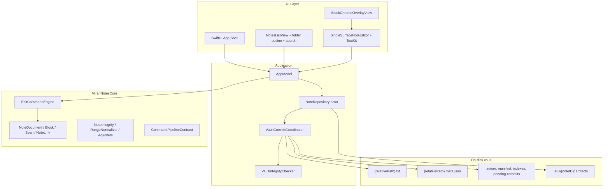

# Miran Notes — Engineering Brief

> **Pivot note (Apr 2026):** Miran Notes is pivoting to a **simple, minimalistic, Mac-native knowledge storer**. The Miran Planning / calendar feature set (menu-bar extra, task and session databases, dashboard, calendar views, Zora migration) has been **deactivated** — source is preserved but the active product no longer surfaces it. References to Planning and investor narrative below are retained for historical context only. Current engineering focus is the core note-taking experience: vault, editor, wiki links, search, and atomic persistence.

**Purpose:** This document explains what Miran Notes is, how it works under the hood, and where the codebase is headed. It is written primarily for **software engineers** who need a map of the system, honest gaps, and improvement areas.

**Scope note:** Financial projections, market sizing, and go-to-market strategy are **not** specified in the repository.

**Document freshness:** This revision reflects the current platform after **nested vault folders (manifest v2)**, **sidebar search with body snippets**, **richer repair and conflict UX**, **vault startup recovery and post-save integrity checks**, **backlink snippets with scroll-to-link navigation**, and related editor and persistence hardening. For file-format and constraint details, see **`Constraints.md`** and **`docs/adr/`**.

---

## 1. Introduction and product overview

### What the app is

**Miran Notes** is a **simple, minimalistic, local-first, macOS-native** knowledge storer. Each note is stored as human-readable files in a **vault**: canonical body text in `{relativePath}.txt`, structured metadata (blocks, inline styles, wiki links, embedded artifact references) in `{relativePath}.meta.json`, plus vault-level indexes under **`.miran/`** (manifest, link graph, relationship index, folder catalog, path index, pending-commit staging). Heavy structured data (for example **tables**) can live under **`_aux/{noteID}/`** as JSONL and schema files (per ADR 0002).

**Problem it solves:** Many knowledge workers want a **fast, trustworthy place to store and connect ideas** without surrendering data to a cloud service or dealing with a heavy, plugin-heavy runtime. Miran targets users who value **simplicity, ownership of files, and predictable behavior** on a Mac—students, researchers, and developers who treat notes as durable assets and want nothing more than a clean editor and reliable storage.

**Why local-first matters:** Notes remain ordinary files that can be backed up, diffed, and opened with other tools. The app adds structure and navigation on top without making the filesystem opaque.

### Why it was created

The motivation (as reflected in project constraints and architecture docs) is to **close the gap** between:

- **Heavyweight cloud editors** that own your data and require constant connectivity, and  
- **Power-user tools** that are extremely capable but can demand significant configuration or operational overhead.

Miran aims for a **disciplined editing pipeline**—commands, integrity checks, atomic persistence—so the product can feel responsive and “modern” while storage stays simple and inspectable.

**Vision (near-term):** Stay simple. **Identity-first linking** and **folder/path organization** are first-class (ADR 0003); links stay stable across renames because **`noteID`** is canonical. The product does not add complexity — optional sync or multi-device layers could sit *above* the local vault, but the core stays minimal and native.

### High-level value proposition

| Theme | What Miran emphasizes |
|--------|------------------------|
| **Trust** | Detect ambiguity between text and metadata; surface repairs and conflicts instead of silent corruption (see Constraints). Startup **vault recovery** finishes interrupted multi-file commits; **post-save integrity** checks can surface non-technical advisories. |
| **Performance posture** | Incremental editor updates, debounced indexing, bounded undo, dirty-flag index writes, debounced backlink refresh with an in-memory link-graph cache—designed to stay responsive on large notes and vaults. |
| **Differentiation** | Not another web app in Electron: **Swift + SwiftUI + TextKit**, command-driven model, **UUID `noteID`** for stable links independent of filenames and folder paths. |
| **Organization** | **Nested folders** with a persisted `FolderCatalog` and `PathIndex`; sidebar tree, search across titles and bodies, and manifest **`relativePath`** as the stable file address (ADR 0003). |
| **Extensibility (directional)** | Open **slash command registry**; `ExtensionRegistry` and **`CommandPipelineContract`** / **`ExtensionCompatibility`** for versioned expectations; command interceptors with UUID lifecycle; sidecars and `_aux/` for heavy data without blocking typing. |

---

## 2. How the app works at the user level

### User journey and main flows

1. **Open or create a vault** — On launch, the app may run **startup recovery** on incomplete commits under `.miran/pending-commits/`, optionally showing a short “library verified” notice. Notes are listed from the manifest; a **full link-graph rebuild** may run after load. The user selects a note from the **sidebar** (folder tree + notes).  
2. **Navigate the workspace** — The **sidebar** shows a **nested folder outline** (`DisclosureGroup`s). Users can **create folders** (toolbar or folder context menu), **create notes**, **delete notes**, and **delete empty folders** (folders with contents must be cleared first—see ADR 0003). Selection is keyed by the note’s **`relativePath`** in the manifest (unique across the vault after the manifest v2 / folder work).  
3. **Search** — The sidebar is **searchable**; matching filters by title, path, and **note body text** (async-built body index). Matching notes can show a **short snippet** of surrounding text for the query.  
4. **Edit in the block-aware editor** — Content is edited in a **single `NSTextView`** surface with block semantics (headings, paragraphs, lists, code, callouts, dividers). Typing flows through a **single pipeline** into `EditCommand`s and `EditCommandEngine`. A **layout controller** coordinates newline split, merge-at-boundary, and list-item exit behavior.  
5. **Format and structure** — Toolbar or shortcuts toggle span styles (bold, italic, code); structural edits (split/merge blocks) follow deterministic rules. Optional **block chrome** (gutter/handle affordances) is drawn in a **non-interactive overlay** aligned to `NSLayoutManager` geometry.  
6. **Slash commands (Notion-like discovery)** — Typing `/` at **line start** opens a **searchable menu** near the caret; built-ins include `/h1`–`/h3`, `/p`, `/code`, `/list` (alias `/bullet`), `/divider`, `/callout`. **Auto-commit** applies when the user types `/token` + space or newline (same commands as the menu). Unknown tokens stay **plain text**; the menu can show “No commands found.”  
7. **Markdown-style list entry** — Typing `-` at line start and committing with **space** can be recognized (`MarkdownCommandDetector`) as a structured list path parallel to slash auto-commit.  
8. **Wiki links** — `[[Display Title]]` in the body; metadata stores ranges and `targetNoteID`. **Clicking** a link in the editor navigates to the target note. The **Link** toolbar menu inserts a link to another note at the **live caret** (`editorCursorOffset`). Links resolve by **note ID**, not filename.  
9. **Backlinks** — A **Backlinks** column shows notes that link *to* the open note, with **context snippets** around the link in the source. Choosing a backlink opens that note and, when possible, **scrolls to the link range** in the editor (`pendingEditorScroll`).  
10. **Tables (structured artifacts)** — Toolbar actions can **add a table** (bootstrap JSONL + schema under `_aux/{noteID}/`) or **open** an existing table in a **table editor sheet** (lazy load; separate concern from the main text surface—ADR 0002).  
11. **Persistence** — Debounced autosave writes text and metadata; vault commit runs a **two-phase** prepare/commit with a **persisted commit journal** and **resumable** renames. **Dirty flags** skip rewriting unchanged index files.  
12. **External edits** — The vault **subtree** is watched; events debounce and autosave-self-writes are ignored. If the buffer is dirty and disk changed, the user gets a **conflict** alert with plain-language copy, **Use the saved file** vs **Keep my edits**, **Show in Finder**, and optional **details** (disk timestamp). `DocumentRevisionToken` complements modification dates where used.  
13. **Integrity and notices** — Load-time normalization, missing wiki metadata, full-buffer replace fallback, size cap, **vault integrity** after save, and **recovery** summaries surface as **dismissible banners** with optional **Details** sheets (non-technical titles; technical lines when needed for support).

**Typical session:** Open the vault, browse folders, search for a phrase, edit with slash commands and formatting, insert internal links from the toolbar, follow backlinks with snippets, rely on autosave, and resolve rare conflicts explicitly.

### Key features and examples

| Feature | Example | Comparison |
|--------|---------|------------|
| **Nested folders + path index** | `work/client/meeting-notes` as `relativePath` | Explorer-like organization; manifest v2 and ADR 0003 define on-disk layout and invariants. |
| **Sidebar search + snippets** | Query “deadline” sees titles and body hits with snippets | Stronger than filename-only search; index builds asynchronously after listing. |
| **Block model + headings** | `/h2` or toolbar formatting | Similar *intent* to Notion blocks; one TextKit surface, not per-block web components. |
| **Slash discovery + auto-commit** | `/bul` filters; `/list⎵` commits without menu | Comparable to Notion’s slash menu; **line-start only** by design (Constraints). |
| **Wiki links** | `[[Project plan]]` + toolbar insert | Like Obsidian wikilinks; **targets are UUIDs in metadata**, reducing breakage on rename/move. |
| **Backlinks** | Snippet + jump to citing link | Graph-aware navigation without a hosted backend. |
| **Undo** | Document-level snapshots, **200 steps** cap, optional **replaceText coalescing** (300 ms) | Simpler mental model than dual undo stacks; memory scales with note size × depth (documented trade-off). |
| **Repair / notices** | Banner + Details for integrity or recovery | Honest about ambiguity—user-visible, not silent rewrite. |

**Differentiation in one sentence:** Familiar *patterns* (slash, wikilinks, blocks, folders) with an **opinionated local-first architecture**: plain text + sidecar + command engine, atomic multi-file commits with recovery—not a hosted document graph or an everything-is-a-plugin model.

### Screens and interactions (textual)

- **Shell:** `NavigationSplitView` — **sidebar** (folder tree, search, toolbar actions) and **detail** (editor or empty state).  
- **Editor:** `HSplitView` — main **single-surface editor** and **Backlinks** strip; toolbar **Link** menu, **Table** / **Open table**, standard **Format** menu shortcuts.  
- **Editor:** `EditorVisualStyle` applies fonts per block type, styled spans, link coloring; **`BlockChromeOverlayView`** draws minimal gutter/handle hints for hovered/focused blocks (pass-through hits).  
- **Caret-aware operations:** `editorCursorOffset` binds caret position for wiki-link insertion and command routing.  
- **Banners:** Dismissible advisories for structural repair, wiki metadata gaps, full-buffer replace, **1 MB (UTF-16) cap**, **vault recovery**, and **vault integrity** warnings—with **Details** where useful.  
- **Conflicts:** Alert + optional detail sheet explaining disk vs unsaved buffer.  

---

## 3. Technical architecture and design decisions

### High-level architecture

**Data flow (create/edit note):** User input → `NSTextStorage` delegate → `EditCommand` batch → `AppModel.apply` (interceptors + `CommandPipelineContract` batch limit) → `EditCommandEngine.apply` → updated `NoteDocument` → `EditorVisualStyle` refresh → debounced save → `NoteRepository` persists via `VaultCommitCoordinator` participants (note files + link graph + relationship index + folder catalog + path index as applicable) → optional `VaultIntegrityChecker` → user advisory if needed.

**Linking:** Outgoing targets update `LinkGraph`; `RelationshipIndex` tracks richer relationships (including artifacts); resolution uses manifest + `LinkResolver`. **Backlinks** use a debounced refresh and optional cached `LinkGraph` load.

### Key components and responsibilities

| Component | Responsibility |
|-----------|----------------|
| **MiranNotesCore** | Domain model, `EditCommand` semantics, `splitBlock` with span/link boundary constraints, integrity and normalization, `ExtensionRegistry`, `CommandPipelineContract`, `ExtensionCompatibility`, `TextEditDiff`, `DocumentRevisionToken`. |
| **MiranNotesApp / AppModel** | Session state, undo checkpoints + `UndoManager`, autosave scheduling, repair and integrity advisories, conflict alerts, backlink/snippet building, body search index scheduling, folder/note CRUD orchestration, `pendingEditorScroll`, command interceptors (UUID deregistration). |
| **SingleSurfaceNoteEditor** | TextKit bridge, incremental vs full-buffer updates, slash/menu UX, markdown bullet commit path, size limit gate, IME-safe behavior. |
| **DocumentLayoutController** | Newline split / merge / empty list-item normalization at the text delegate layer. |
| **SlashCommandRegistry** | Built-ins + **open** `register(_:)` for additional commands. |
| **NoteRepository** | Vault lifecycle, **`reconcileManifest()`** (scan/repair vs disk), read-only **`listNotes()`**, manifest load/rebuild internals, atomic writes, `NoteLoadResult` with repair warnings, **startup recovery**, index cache invalidation, **rebuildLinkGraphFull**, folder and note path operations per ADR 0003. |
| **VaultCommitCoordinator** | Two-phase **prepare → journal-backed rename** under `.miran/pending-commits/`; resumable on crash. |
| **Indexes** | `LinkGraph`, `RelationshipIndex`, `FolderCatalog`, `PathIndex` — each with **`isDirty`** to skip unnecessary writes. |
| **VaultIntegrityChecker** | Post-commit consistency checks (manifest vs disk, graph referential integrity, saved note shape). |

### Important design decisions (and trade-offs)

1. **`noteID` as single source of truth** — `NoteDocument.id` is computed from `metadata.noteID`. **`relativePath`** is the canonical *address* for files under the vault (unique, nested). **Trade-off:** Extra indirection vs path-as-identity; **win:** stable links across renames and moves.  
2. **Plain text + sidecar vs rich text file** — Canonical string in `.txt`; styles/links in JSON. **Trade-off:** Reconcile when external tools edit `.txt` only; **win:** human-readable, diff-friendly body.  
3. **Command-only mutation** — Structural edits go through `EditCommandEngine`. **Trade-off:** Up-front rigor; **win:** testability and consistent invariants.  
4. **Snapshot undo** — Not inverse commands; coalescing for rapid `replaceText`. **Trade-off:** Memory; **win:** correctness and simpler reasoning (`NoteDocument.estimatedUndoMemoryBytes` for diagnostics).  
5. **No SQLite in core path** — Files + JSON indexes. **Trade-off:** Custom consistency discipline; **win:** transparency, simple backup story.  
6. **Atomic multi-file commits + recovery** — Staging dir + journal; **startup recovery** completes or discards interrupted work.  
7. **Semantic reconciliation policy** — When text and metadata disagree, the system **must not silently guess user intent**; user-visible repair/conflict flows (Constraints).  
8. **Tables in JSONL (ADR 0002)** — Heavy rows off the main editing loop; separate sheet editor.  
9. **Extension contracts** — `ExtensionContractVersion`, `CommandPipelineContract.maxCommandsPerBatch`, `ExtensionCompatibility.supports` — **directional** stability for interceptors and future modules; not a full plugin marketplace yet.

### Extensibility and future-proofing

- **Schema versioning** in metadata and manifest (`VaultManifest.schemaVersion` 2) supports migration (legacy `baseName` decodes as `relativePath`).  
- **`ExtensionPoints.swift`** documents roadmap placeholders without forcing premature implementation.  
- **Slash registry** allows new commands without forking the editor.  
- **Auxiliary storage** (`_aux/{noteID}/`) holds structured artifacts without merging megabytes into `note.txt`.

**Engineering expectation:** New features should state **what is stored where**, how **migration** works, and impact on **performance** and **constraints** (per internal docs).

---

## 4. Critical analysis and gaps

### Honest assessment of the current system

**Solid:**

- Clear split: **Core** (model + engine) vs **App** (UI + persistence).  
- Documented **constraints** and **ADRs** for links, auxiliary storage, folders/paths (0003), slash behavior.  
- **Automated tests** (core, app, watcher races, performance baselines, copy stability tests) and explicit **integrity** hooks.  
- **Hardening** shipped: journal-backed commits, startup recovery, dirty index writes, debounced backlink refresh, bounded undo, repair and integrity notices, external-edit conflict path with clearer copy, nested vault paths with **FolderCatalog** / **PathIndex** wired through repository and **sidebar UI**.  
- **Product UX** now includes folder tree, search-with-snippets, backlink snippets, table toolbar, and wiki-link insertion—not only index layers.

**Fragile or evolving:**

- **Dual representation** (canonical model vs `NSTextView`) is disciplined but not formally proven—edge cases around layout, RTL, and block chrome remain ongoing (Constraints).  
- **Multi-file vault** is not a transactional DB—failure semantics stay explicit; crash mid-commit is mitigated by **recovery**, not eliminated for every theoretical race.  
- **Repository** still blends orchestration, manifest, and indexes—**may benefit from sharper internal modules** as features grow.  
- **`ExtensionRegistry` vs `SlashCommandRegistry` vs interceptors** — multiple extension vectors; a **unified third-party extension product story** (distribution, versioning, sandboxing) is still not end-to-end.  
- **Selection** uses manifest **`relativePath`** strings in the UI; with nested paths they are unique—engineers should keep **rename/move** flows and tests aligned when evolving selection APIs.

### Gaps and improvement opportunities

| Gap | Why it matters |
|-----|----------------|
| **Deeper block chrome** | Drag-to-reorder and per-block menus would need more TextKit investment; overlay is visual-only today. |
| **Performance budgets in CI** | Baselines exist; **enforcing** budgets in CI would improve regression safety. |
| **Plugin/extension distribution** | Contract types exist; **semver-style guarantees**, signing, and marketplace rules are not defined. |
| **Undo memory policy** | Large notes × retained checkpoints—user-visible policy or diff-based undo could be future work. |
| **TOCTOU on external edits** | Documented limitation; advanced users may hit edge cases. |
| **Test coverage vs all UI paths** | Core and repository are strong; full UI matrix may need expansion. |

### Prioritized improvement areas (for leverage)

**First (foundation):**

1. **Conflict and repair UX** — continue refining language and diagnostics where users still see edge-case technical wording.  
2. **Extension contract** — align `ExtensionDescriptor`, capabilities, and tests with real shipped interceptors or sample plugins.  
3. **Performance** — typing/save latency budgets, large-vault benchmarks in CI.

**Next:**

4. **Observability** — structured telemetry for repair rate, conflict rate, normalize fallback frequency (Console categories exist; productize selectively).  
5. **Repository modularization** — separate manifest, index mutation, and filesystem concerns as the codebase grows.

**Later / nice-to-have:**

- Richer **block chrome** interactions (costly in TextKit).  
- **Real-time collaboration** — explicitly **out of scope** for core architecture today (Constraints); would be a different product bet.

---

## 5. Comparisons and positioning

### Versus Notion

| Dimension | Notion | Miran Notes |
|-----------|--------|-------------|
| **Deployment** | Hosted / hybrid | **Local vault** on disk |
| **Data model** | Workspace databases, blocks as service primitives | **Files + sidecar JSON**, command-driven block model, **nested folders** |
| **Slash commands** | Rich palette, DB-linked blocks | **Open registry**, line-start discovery + auto-commit, built-in structural commands |
| **Collaboration** | Real-time multi-player | **Single-writer** baseline |

**Similar:** Slash discovery, block-typed content, search, structured organization.  
**Different:** Miran **does not** bundle hosted databases or collaboration; it **optimizes for file ownership and a native macOS editor** with **offline** operation.

### Versus Obsidian

| Dimension | Obsidian | Miran Notes |
|-----------|----------|-------------|
| **Extensibility** | Large plugin ecosystem | **Native core**; **ExtensionRegistry**, slash registration, and **command interceptors** as hooks |
| **Storage** | Markdown files, plugins add frontmatter/features | **`note.txt` + `note.meta.json`** at **`relativePath`**, explicit metadata for spans/links |
| **Platform** | Cross-platform | **macOS** (Swift Package) |
| **Linking** | Wikilinks + plugins | **`[[...]]` + `noteID` metadata** (ADR 0001) |

**Similar:** Wikilink mental model, graph-style thinking, local vault, folder hierarchies.  
**Different:** Miran is **not** Electron; plugins are **not** the primary extension story yet; **opinionated** pipeline for integrity, **recovery**, and saves.

### Concrete usage scenarios

1. **Student preparing for exams** — Course folders per subject, search across notes, callouts and lists, links between topics (`[[…]]`). **Architecture:** fast autosave, offline-only, no account.  
2. **Lawyer organizing matters** — Nested folders per client or matter; internal links between memos; conflict prompts if a file is edited outside the app. **Architecture:** identity-first links reduce breakage when paths change.  
3. **Developer documenting a system** — Code blocks, wiki links between design docs; JSONL tables for structured reference data without bloating the note body. **Architecture:** auxiliary files per ADR 0002.

---

## 6. Conclusion and next steps

### Product direction summary

Miran Notes is a **native, local-first** Mac knowledge storer: clean editor, wiki links, nested folders, fast search, and atomic persistence — nothing more. The **Miran Planning** feature set (calendar, tasks, sessions, dashboard) has been deactivated as part of a deliberate pivot toward minimalism. The codebase retains a disciplined architecture (core vs app, ADRs, constraints, tests) that can support future small features without accumulating complexity.

### Guidance for the implementing engineer

Use this document as a **map**, not a substitute for reading **`Constraints.md`**, **`README.md`**, **`docs/README.md`**, **ADRs**, and the code pointers there.

**You are expected to:**

1. Treat **`Constraints.md`** as binding for semantic reconciliation, slash contracts, undo, external-edit behavior, and persistence semantics.  
2. Use **ADRs** (`docs/adr/`) for durable decisions on links, auxiliary storage, and **folders/paths/manifest v2**.  
3. **Identify gaps** between documentation and behavior and either align code or update docs.  
4. **Propose improvements** that strengthen invariants first (persistence, integrity, UX for repair/conflict), then extension and performance polish.  
5. Add **tests** when changing `EditCommandEngine`, repository commits, or filesystem watchers.

### Ambiguities and what would make this fully concrete

The following are **not fully determined from the repository alone** and should be clarified with product ownership:

- **Business model** (paid app, subscription, open-core, etc.).  
- **Roadmap dates** and **platform expansion** (e.g., iPad, iPhone, Windows).  
- **Sync strategy** (if any)—would be layered on local-first storage per roadmap placeholders.  
- **Third-party extension distribution** (Mac App Store rules, notarization, sandboxing).  

---

*Generated from repository sources: `README.md`, `Constraints.md`, `docs/README.md`, `docs/adr/*`, `docs/architecture/*`, and `Sources/MiranNotesCore` / `Sources/MiranNotesApp`.*
